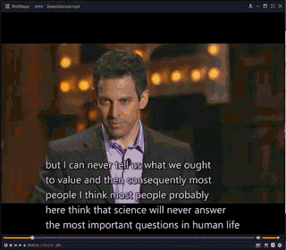

# SubtitleGenerator mp4视频字幕自动生成程序

## 使用方法

1. 添加jar包依赖，这些依赖放在 .\lib中：aip-java-sdk-4.1.1.jar   jave-1.0.2.jar  json-20160810.jar  log4j-1.2.17.jar

2. 把视频放在路径：.\SubtitleGenerator\src\main\java\com\joe\SubtitleGenerator\test 中（字幕会生成在同名文件目录下）
在 subtitleGenerator.java 第10行中，输入视频的名字；第11行选择语言。

3. 设置百度AI的账号。因为我在音频转字幕的过程调用了百度的API，所以你要注册一个百度AI的账号，以及申请一个App，然后在 subtitleGenerator.java的第18、19、20行中设置你的 APP_ID、API_KEY、SECRET_KEY
(具体申请百度AI账号以及App的方法请查询百度AI的官方文档：http://ai.baidu.com/docs#/ASR-Online-Java-SDK/top)

4. 运行 subtitleGenerator.java中的main函数，即可得到 字幕(src格式)。

## 算法流程
1. 把视频(mp4)转换成音频(wav)
2. 在没有声音的音频采样点进行切割。
3. 把切割后的音频提交给百度语音API，拿到字幕
4. 根据src的字幕规则，生成字幕。

## 测试样例

放在 .\SubtitleGenerator\src\main\java\com\joe\SubtitleGenerator\test\SpeechSample.mp4

生成的字幕文件：.\SubtitleGenerator\src\main\java\com\joe\SubtitleGenerator\test\SpeechSample.src

